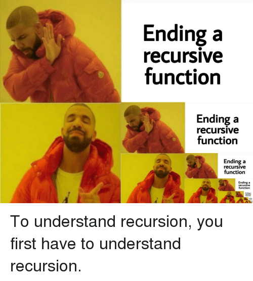

layout: true
class: middle, center

---
# Dependently Typed Programming Languages

---

.wide.image[]

---

.tall.image[]

---

.tall.image[]

---

# &#91; &#128230;, &#128230;, &#8230;, &#128230; &#93;

--

# &#8615;
# &#40; &#128230;, &#91; &#128230;, &#128230;, &#8230;, &#128230; &#93; &#41;

---

# &#91; &#127820;, &#127822;, &#127821; &#93;
# &#8615;
# &#40; &#127820;, &#91; &#127820;, &#127822;, &#127821; &#93; &#41;

---

# How to prevent?

---

# Test

---

# Formal Specification

---

# Types

---

# Interlude

> God made the integers; all else is the work of man &mdash; Leopold Kronecker

--

-----

> Nope &mdash; Giuseppe Peano

---

# Natural Numbers
## Zero
## Successor(n)

---

# &#91; &#127820;, &#127822;, &#127821; &#93;
# &#8615;
# &#40; &#127820;, &#91; &#127820;, &#127822;, &#127821; &#93; &#41;

---

# Curry-Howard Correspondence

---

# Type Driven Development
