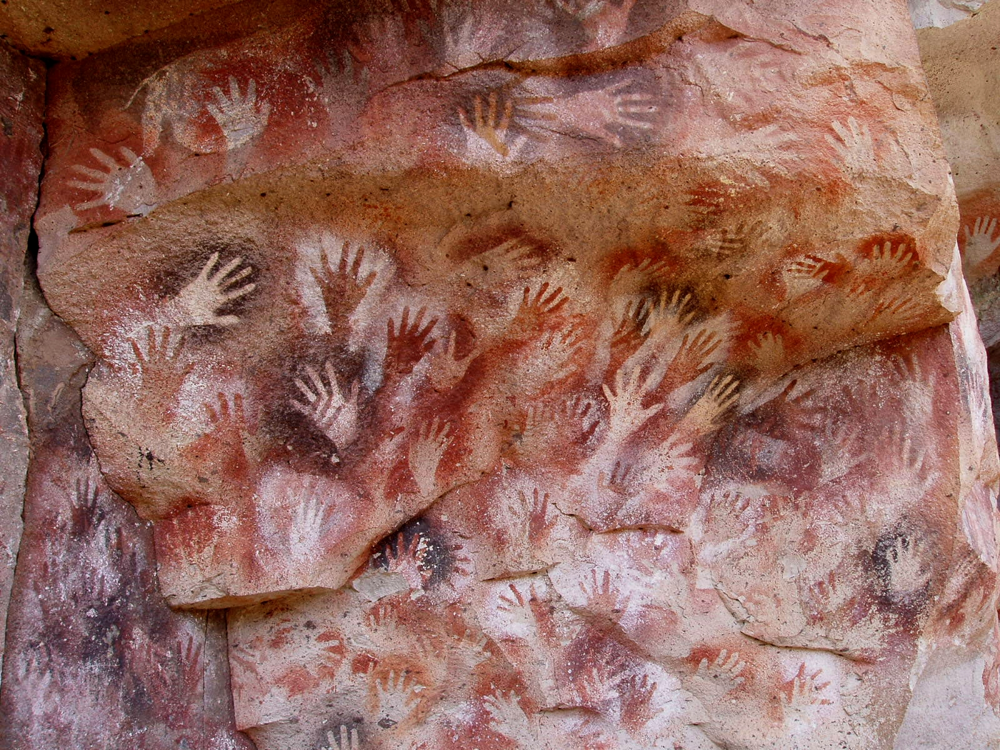
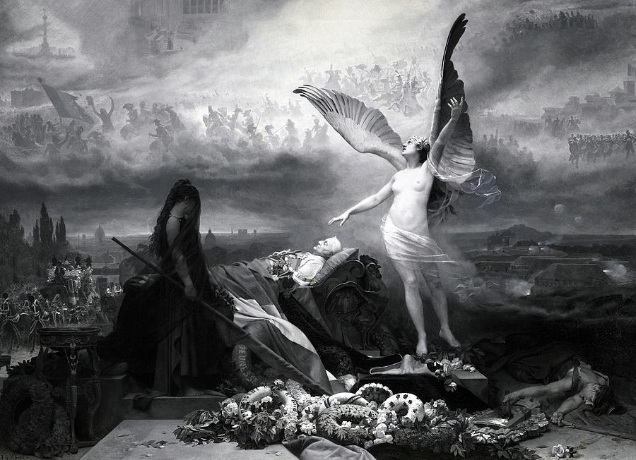

layout: true
class: middle, center

---

# Introducing `elm-spa`

---

.tall.image[]

???

* Cave paintings are all over the world
* Oldest known Cave painting is 50.000 years old, in India
* This particular technique is stencelling 
---

.wide.image[]

???

* The creation of Adam, by Michelangelo
* Sistene chapel

---

> If you wish to make an apple pie from scratch, you must first invent the universe.
> &mdash; Carl Sagan

---

# Culture

--

## Tools

---

.tall.image[]

???

# Elm

---

.wide.image[]

???

# `elm-spa`

---

.wide.image[]

???

* First president of the third French Republic
* Cueva de las manos - By Mariano - Own work, CC BY-SA 3.0, [https://commons.wikimedia.org/w/index.php?curid=265811](https://commons.wikimedia.org/w/index.php?curid=265811)
* The Creation of Adam - By Michelangelo - This file has been extracted from another file: Creación de Adán.jpg, Public Domain, https://commons.wikimedia.org/w/index.php?curid=29099348